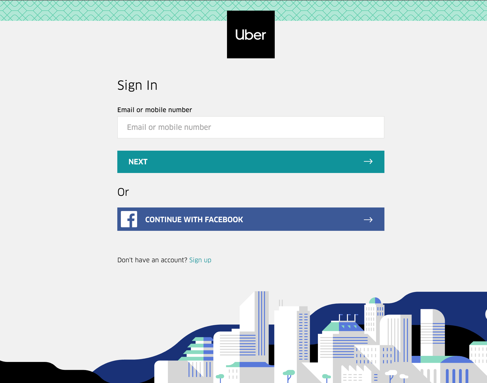

# DevOps-The-Hard-Way-Azure

This tutorial contains a full, real-world solution for setting up an environment that is using DevOps technologies and practices for deploying apps and cloud services/cloud infrastructure to Azure.

The repository contains free labs, documentation, diagrams, and docs for setting up an entire workflow and DevOps environment from a real-world perspective in Azure.

## DevOps Scenario
The scenario that you're currently facing is you work in an organization that is very monolithic. There is a ton of bare metal, virtualization, manual deployments of applications, and **old school** practices based on the current teams knowledge of IT.

You're brought in to the company and team to make things more modern so the organization can not only succeed, but stay ahead of their competition. Management now understands the needs and complexity that comes with staying ahead of their competition and they know that they need to. Otherwise, the organization will fall...

## DevOps Solution
The solution is to deploy the Uber API for the sign-up page. Currently this solution is sitting on a bunch of baremetal, but it's time to sprinkle a little DevOps on it.

As a DevOps Engineer, you're more or less (most likely) not writing the app, but instead, deploying it. That's why you're not writing your own app in this tutorial.

*Full Disclosure* - [AdminTurnedDevOps](https://github.com/AdminTurnedDevOps) did have to edit this app a bit from Uber to make it compatible with Python3. You can find the repo here:

https://github.com/AdminTurnedDevOps/Python-Sample-Application

## Technology Details
You will be using the following technologies and platforms to set up a DevOps environment.

1. Azure
    - Azure will be used to host the application, cloud infrastructure, and any other services we may need to ensure the Uber app is deployed properly.
2. GitHub
    - To store the application and infrastructure/automation code
3. Python
    - Python will be used for the Uber app (it is written in Python) and some automation efforts that aren't in Terraform.
4. Terraform
   - Create an Azure ACR repository with Terraform
   - Create an AKS cluster
5. Docker
   - Create a Docker image
   - Store the Docker image in Azure ACR
6. Kubernetes
   - To run the Docker image that's created for the containerized Uber app. Kubernetes, in this case, AKS, will be used to orchestrate the container.
7. CI/CD
   - Use GitHub Action to create an AKS cluster
8. Automated testing
    - Testing Terraform code with Checkov

## Labs
1. [Prerequisites](https://github.com/thomast1906/DevOps-The-Hard-Way-Azure/blob/main/prerequisites.md)
2. [Create Storage Account for Terraform State file](https://github.com/thomast1906/DevOps-The-Hard-Way-Azure/blob/main/Azure/1-Configure-Terraform-Remote-Storage.md) - When deploying Terraform there is a requirement that it must store a state file; this file is used by Terraform to map Azure Resources to your configuration that you want to deploy, keeps track of meta data and can also assist with improving performance for larger Azure Resource deployments.
3. [Create Azure AD Group for AKS Admins](https://github.com/thomast1906/DevOps-The-Hard-Way-Azure/blob/main/Azure/2-Create-Azure-AD-Group-AKS-Admins.md) - The Azure AD Group will be used for AKS cluster access

In this scenario, the Terraform State file will be stored in remote state location of an Azure Storage Account.

2. Terraform - The purpose of the Terraform section is to create all of the Azure cloud services you'll need from an environment/infrastructure perspective to run the Uber application.
    - [Create ACR](https://github.com/thomast1906/DevOps-The-Hard-Way-Azure/blob/main/Terraform-AZURE-Services-Creation/1-Create-ACR.md)
    - [Create VNET](https://github.com/thomast1906/DevOps-The-Hard-Way-Azure/blob/main/Terraform-AZURE-Services-Creation/2-Create-VNET.md)
    - [Create Log Analytics](https://github.com/thomast1906/DevOps-The-Hard-Way-Azure/blob/main/Terraform-AZURE-Services-Creation/3-Create-Log-Analytics.md)
    - [Create AKS Cluster with relevant IAM roles](https://github.com/thomast1906/DevOps-The-Hard-Way-Azure/blob/main/Terraform-AZURE-Services-Creation/4-Create-AKS-Cluster-IAM-Roles.md)

3. Docker - The purpose of the Docker section is to create a Docker image from the app that the organization is running on-prem (the uber app), containerize it, and store the container inside of a container repository. For the container repo, you'll use Azure ECR.
    - [Create The Docker Image](https://github.com/thomast1906/DevOps-The-Hard-Way-Azure/blob/main/Docker/1-Create-Docker-Image.md)
    - [Log Into Azure ACR Repository](https://github.com/thomast1906/DevOps-The-Hard-Way-Azure/blob/main/Docker/Push%20Image%20To%20ACR.md)
4. Kubernetes - The purpose of the Kubernetes section is to connect to AKS locally and to write the Kubernetes manifest to deploy the Python Uber app.
    - [Connect To ACR From The Terminal](https://github.com/thomast1906/DevOps-The-Hard-Way-Azure/blob/main/kubernetes_manifest/1-Connect-To-ACR.md)
    - [Create A Kubernetes Manifest](https://github.com/thomast1906/DevOps-The-Hard-Way-Azure/blob/main/kubernetes_manifest/2-Create-Kubernetes-Manifest.md)
    - [Deploy Uber App into Kubernetes](https://github.com/thomast1906/DevOps-The-Hard-Way-Azure/blob/main/kubernetes_manifest/3-Deploy-Uber-App.md)
5. Automated Testing - The purpose of the Automation Testing section is to ensure that all of the Terraform code is performing as it should be from a policy, security, and static code analysis perspective.
    - [Install And Run Checkov](https://github.com/thomast1906/DevOps-The-Hard-Way-Azure/blob/main/Terraform-Static-Code-Analysis/1-Checkov-For-Terraform.md)
6. CICD - The purpose of this section is to automatically create an AKS cluster with CICD using GitHub Actions
    - [Create a GitHub Actions CICD pipeline](https://github.com/thomast1906/DevOps-The-Hard-Way-Azure/blob/main/Terraform-AZURE-Services-Creation/5-Run-CICD-For-AKS-Cluster.md)
