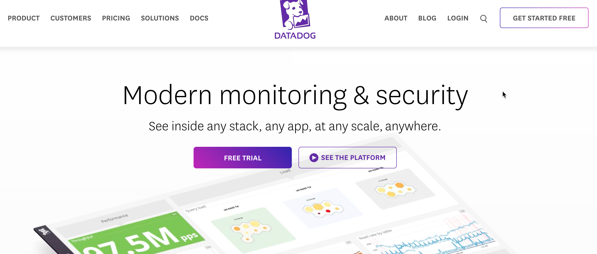
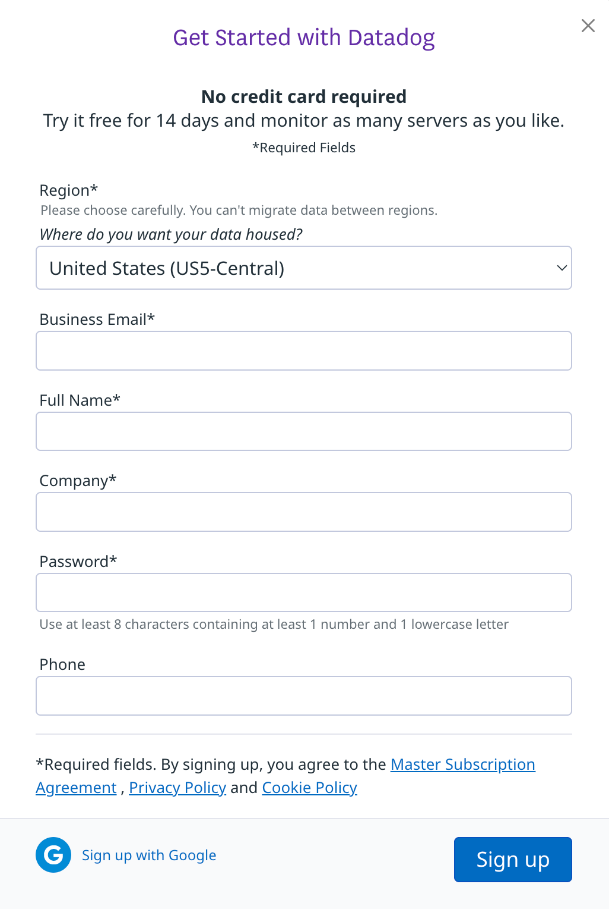

# Monitoring and Observability With Datadog

In this lab, you'll configure monitoring and observability for your EKS cluster and app stack running within the EKS cluster with Datadog.

**You can sign up for Datadog for free and as long as you don't leave the cluster running within Datadog, you will not receive a bill**

## Setting Up A Datadog Account

1. Go to https://www.datadoghq.com/

2. Click the **GET STARTED FREE** button.

3. Sign up using Google. You should be able to sign up using your personal Gmail account.

## Creating A Datadog API Key

## Installing Datadog With Helm

