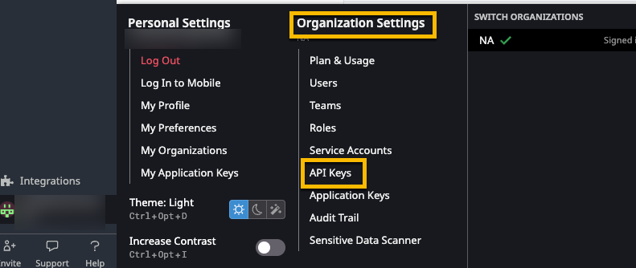
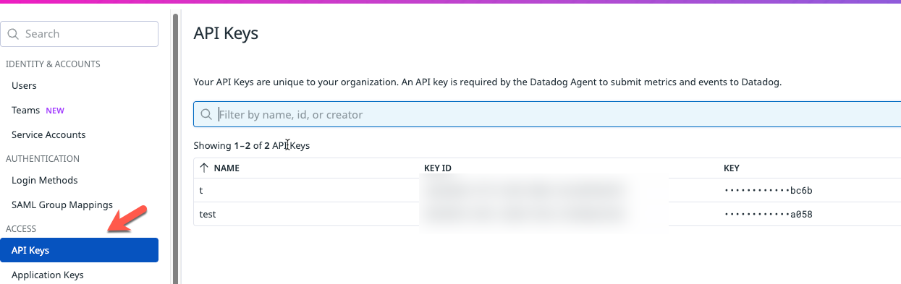

# Monitoring and Observability With Datadog and Helm

In this lab, you'll configure monitoring and observability for your EKS cluster and app stack running within the EKS cluster with Datadog.

**You can sign up for Datadog for free and as long as you don't leave the cluster running within Datadog, you will not receive a bill**

## Setting Up A Datadog Account

1. Go to https://www.datadoghq.com/

2. Click the **GET STARTED FREE** button.


3. Sign up using Google. You should be able to sign up using your personal Gmail account.


## Creating A Datadog API Key

1. Within Datadog, under your account, go to **Organization Settings > API Keys**


2. Generate a new API key.


## Installing Datadog With Helm

1. Set environment variables. These will consist of the name of your cluster and the API key you generated in the previous section.

```
CLUSTER_NAME=
API_KEY=
 (get the API key from Organization Settings in Datadog)
```

2. Add the Datadog Helm Repo
```
helm repo add datadog https://helm.datadoghq.com
```

3. Ensure that the repo is up to date.
```
helm repo update
```

4. Deploy Datadog with Helm. The configuration below will ensure a High Availability (HA) Datadog installation.
```
helm install datadog -n datadog \
--set datadog.site='datadoghq.com' \
--set datadog.clusterName=$CLUSTER_NAME \
--set datadog.clusterAgent.replicas='2' \
--set datadog.clusterAgent.createPodDisruptionBudget='true' \
--set datadog.kubeStateMetricsEnabled=true \
--set datadog.kubeStateMetricsCore.enabled=true \
--set datadog.logs.enabled=true \
--set datadog.logs.containerCollectAll=true \
--set datadog.apiKey=$API_KEY \
--set datadog.processAgent.enabled=true \
--set targetSystem='linux' \
datadog/datadog --create-namespace
```

